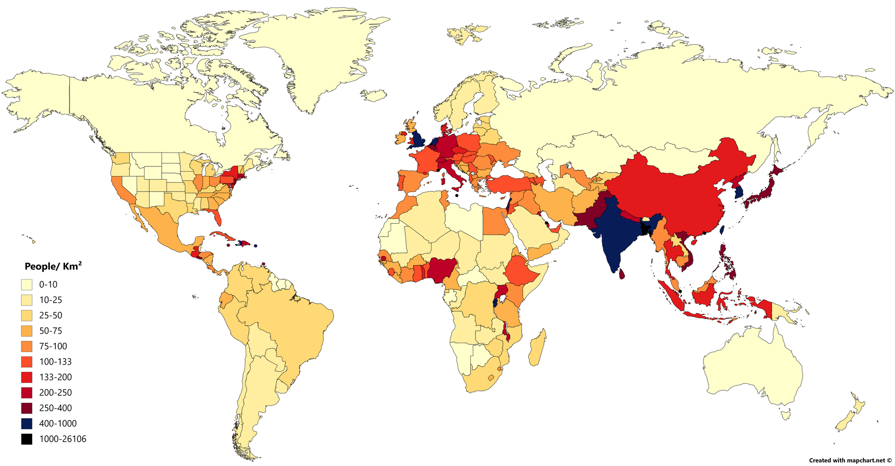
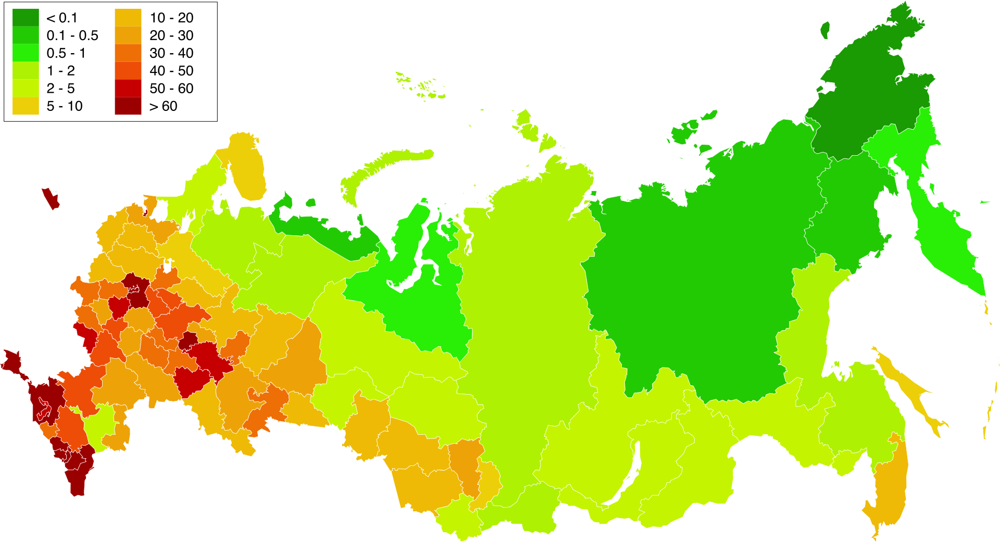
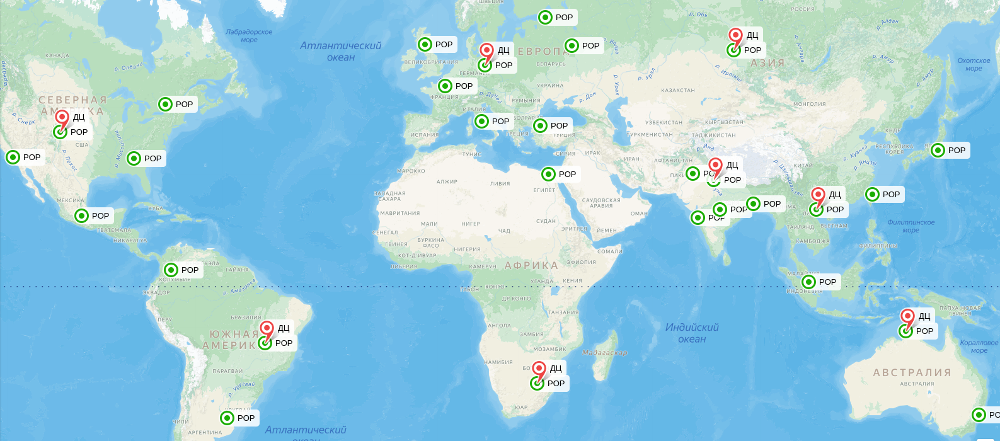
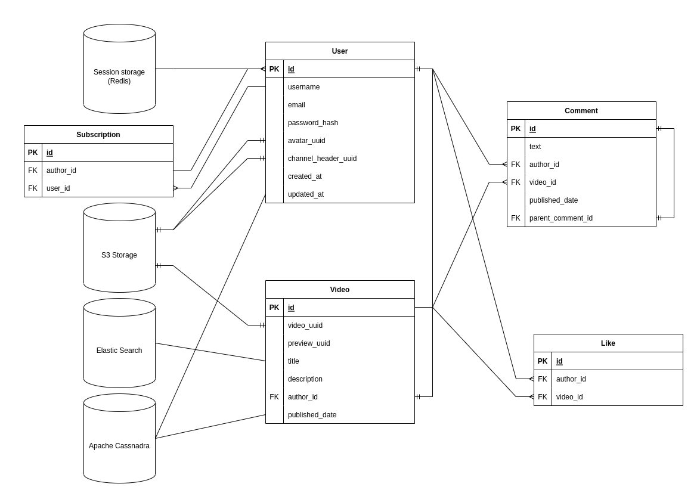

# YouTube
Курсовой проект по дисциплине "Проектирование высоконагруженных систем" VK Education в МГТУ.

## 1. Тема и целевая аудитория
YouTube - видеохостинг, предоставляющий своим пользователям возможность просмотра, оценки, комментирования и загрузки видео.

### Ключевой функционал 
- Список рекомендованных видео
- Поиск видео
- Просмотр видео
- Загрузка видео
- Добавление комментариев к видео
- Оценка видео посредством лайков/дизлайков
- Подписка на автора контента

### Целевая аудитория
Видеохостинг имеет 2,7 миллиарда активных пользователей в месяц [1].
Данные о месячной аудитории по странам представлены в таблице.

| Страна    | Количество пользователей в месяц, млн |
| --------- | ------------------------------------- |
| Индия     | 476                                   |
| США       | 238                                   |
| Бразилия  | 147                                   |
| Индонезия | 139                                   |
| Россия    | 95,4 [2]                              |
| Мексика   | 84,2                                  |
| Япония    | 79,4                                  |
| Пакистан  | 66,1                                  |
| Германия  | 65,7                                  |
| Вьетнам   | 63                                    |

## 2. Расчет нагрузки
### Продуктовые метрики
- 122 млн. активных пользователей в день (DAU) [1]
- 2,7 млрд. активных пользователей в месяц (MAU) [1]
- Среднее время просмотра - 19 минут в день [3]
- На сервисе размещено 4 млрд. видео [4]. Их суммарная длительность: 12,5 мин / 60 мин * 4 млрд = 800 млн. часов
- Каждую минуту на YouTube загружается 360 часов видео [4]
- Среднее видео длится 12,5 минут [4]
- Среднее видео набирает 5600 просмотров [5]
- 2 из 1000 пользователей оставляют комментарий к видео
- 4 из 1000 пользователей сотавляют оценку к видео

### RPS по типам запросов
Предположим, что пользователь посещает страницу рекомендаций 2 раза в день и 1 раз в день производит поиск видео. Такой вывод можно сделать, если исходить из того, что среднее видео длится 12,5 минут, а пользователь проводит на видеохостинге 19 минут в день. В таком случае он должен дважды открыть видео, что чаще всего делают со страницы рекомендаций.

Пусть видео отдаются пользователю блоками размером в 1 минуту.

Среднее количество видео, которое все пользователи загружают на видеохостинг в день: 360 часов * 60 * 24 / 12,5 минут = 2 488 320.

Предположим, что пользователь подписывается на новые каналы 5 раз в год.

Рассчитаем средний RPS как (количество запросов в день на пользователя) * DAU / 86 400 с.

| Тип запроса         | Количество запросов в день на пользователя | Средний RPS   | Пиковый RPS |
| ------------------- | ------------------------------------------ | ------------- | ----------- |
| Список рекомендаций | 2                                          | 2 824         | 7 060       |
| Поиск видео         | 1                                          | 1 412         | 3 530       |
| Просмотр видео      | 19                                         | 26 828        | 67 070      |
| Загрузка видео      | 0,02                                       | 28            | 70          |
| Комментарий         | 0,002                                      | 3             | 8           |
| Оценка видео        | 0,004                                      | 6             | 15          |
| Оформление подписки | 0,015                                      | 21            | 52          |
| Суммарно за день    | 22,041                                     | 31 122        | 77 805      |

### Технические метрики
- Один час FHD видео на YouTube в среднем весит 4 Гб, HD - 2,5 Гб, 480p - 0,68 Гб [6]. Исходя из этого, можно расчитать, что видео в качестве 360p будут весить 0,38 Гб, 240p - 0,17 Гб, 144p - 0,06 Гб.
- Расчитаем размер хранилища для видео с учетом того, что они сохранются в шести вышеперечисленных разрешениях
- Размер пользовательского хранилища составляет 1 Мб

### Объем сохраняемых данных
| Тип данных           | Средний размер единицы данных | Количество данных | Размер данных |
| -------------------- | ----------------------------- | ----------------- | ------------- |
| Профиль пользователя | 1 Мб/шт                       | 2,5 млрд. шт      | 2 384 Тб      |
| Видео                | 7,79 Гб/час                      | 800 млн. часов    | 5 942 Пб      |
| Комментарии          | 1 Кб/шт                     | 44 млрд. шт       | 41 Тб          |

### Сетевой трафик
| Тип запроса         | Трафик на одно действие | Пиковый RPS | Пиковый трафик, Гбит/с | Суммарный суточный трафик, Гбайт/сутки |
| ------------------- | ----------------------- | ----------- | ---------------------- | -------------------------------------- |
| Список рекомендаций | 2 Мб                    | 7 060       | 110                    | 476 550                                |
| Поиск видео         | 2 Мб                    | 3 530       | 55                     | 238 275                                |
| Просмотр видео      | 68 Мб                   | 67 070      | 35 630                 | 153 925 650                            |
| Загрузка видео      | 853 Мб                  | 70          | 466                    | 2 015 212                              |

### Прирост данных за год
- Средний годовой прирост MAU видеохостинга на протяжении последних 10 лет составлял 200 млн. пользователей [7]
- Прирост видео за год: 360 часов * 60 * 24 * 365 = 189 млн. часов

| Тип данных           | Средний размер единицы данных | Прирост единицы данных | Прирост данных |
| -------------------- | ----------------------------- | ---------------------- | -------------- |
| Профиль пользователя | 1 Мб/шт                       | 200 млн. шт            | 190 Тб         |
| Видео                | 7,79 Гб/час                   | 189 млн. часов         | 1 400 Пб       |

## 3. Глобальная балансировка нагрузки
### Функциональное разбиение по доменам
Целесообразно будет вынести в отдельный домен сервис для отправки видео клиенту, так как на этот тип запроса приходится более большая часть трафика.

### Расположения CDN
Так как видеохостинг широко используется во всем мире, необходимо иметь точки присутствия (POP) во всех частях света, а также несколько POP в странах, которые находятся в списке 10 стран с самым большим MAU (см. таблицу в пункте 1). Размещать POP следует с учетом числа людей [8] и плотности населения в разных странах.

| Регион           | Местоположение POP | Обоснование выбора местоположения |
| ---------------- | ----------------- | --------------------------------- |
| Северная Америка | Нью-Йорк, Остин, Атланта, Лос-Анджелес, Денвер, Оттава, Ванкувер, Мехико | Первые пять POP будут обслуживать трафик в США, POP в Остине, Атланте и Мехико также смогут принимать трафик из Мексики. Последние два нужны для Канады, а также Севера США. |
| Южная Америка    | Богота, Ла-Пас, Буэнос-Айрес, Манаус, Бразилиа, Сан-Паулу | POP в Боготе будет служить для обслуживания Латинской Америки, POP в Ла-Пасе и Буэнос-Айресе - для обслуживания южной и западной части континента. В Бразилии будет размещено три POP, так как эта страна находится на 3 месте по численности месячной аудитории. |
| Африка и Ближний Восток | Йоханнесбург, Каир    | Африка - регион с низким проникновением интернета, ни одна страна из этой части света не входит в вышеуказанный список, поэтому имеет смысл поставить POP на севере и на юге континента. POP в Каире также сможет обслуживать Ближний Восток. |
| Океания          | Аделаида, Дарвин, Сидней, Джакарта, Сингапур, Бруней | Первые три POP будут обслуживать Юг и Север Австралии соответственно, а также Папуа. Остальные необходимо как для обсуживания всей Океании, так и для Индонезии (4 место в спике по MAU). |
| Азия             | Тайбэй, Токио, Вьентян, Ханой, Хошимин, Мандалай | Первые POP необходим для Тайваня, Японии и близлежащих островов. Остальные POP равномерно распределены по Юго-Востоку Азии. |
| Индия и Пакистан | Бангалор, Мумбаи, Нагпур, Вишакхапатнам, Калькутта, Нью-Дели, Мултан | Эти две страны вынесены отдельно, так как географически они близки друг к другу, а также Индия занимает первое место по месячной аудитории (476 млн. чел.) В связи с этим была необходимость в том, чтобы разместить в Индии 5 POP, которые будут равноудалены друг от друга. Также POP в Нью-Дели смогут пользоваться соседние страны с низким охватом интернета (Непал, Бангладеш). POP в Пакистане смогут также обслуживать Ближний Восток. | 
| Россия | Москва, Санкт-Петербург, Краснодар, Новосибирск, Хабаровск | Россия вынесена отдельно в виду своих больших размеров. POP в Санкт-Петербурге будет обслуживать Европейский Север и Финляндию, в Москве - центральную часть страны, а в Краснодаре - южную. POP в Новосибирске и Хабаровске нужно для обслуживания Сибири и Дальнего Востока соответственно. |
| Европа | Лондон, Эдинбург, Мадрид, Берлин, Париж, Рим, Стамбул | POP равномерно распределены по Европе с учетом плотности населения. Для Британии и Ирландии необходимо два POP, так как плотность населения там высокая. Отдельный POP нужен Германии, как стране с MAU 65,7 млн. человек. |

### Расположения ДЦ
| Регион           | Местоположение ДЦ | Обоснование выбора местоположения |
| ---------------- | ----------------- | --------------------------------- |
| Северная Америка | Нью-Йорк, Ванкувер, Мехико | Первый и третий ДЦ будут обслуживать север и центр США, а также Канаду. Второй будет нужен для юга США. ДЦ в Мехико будет обслуживать Мексику, а также сможет принимать трафик из США в случае выхода их ДЦ из строя |
| Южная Америка    | Богота, Бразилиа, Буэнос-Айрес | Первый обслуживают Латинскую Америку и север континента, второй и третий - центр и юг соответственно. |
| Африка и Ближний Восток | Каир, Йоханнесбург | Первый для севера континента и Ближнего Востока, второй - для юга Африки. |
| Океания          | Сингапур, Дарвин, Аделаида | Аналогичное деление на север, центр и юг. |
| Азия             | Токио, Ханой | Восток и Запад соответственно. |
| Индия и Пакистан | Бангалор, Нью-Дели | Первый будет обслуживать юг Индии, второй - север страны и Пакистан. |
| Россия           | Москва, Новосибирск, Хабаровск | Обслуживание центральной части РФ, Сибири и Дальнего Востока, а также соседей по СНГ. |
| Европа           | Лондон, Берлин, Рим | Обслуживание западной, центральной и южной частей Европы. |

### Карта с POP и ДЦ
Ниже представлена карта с расположением всех ДЦ и точек присутствия CDN. Первые объекты обозначены красным цветом, вторые - зеленым.

### Расчет распределения запросов по ДЦ
Общее количество POP - 47, ДЦ - 21. Определим распределение запросов по разным регионам, исходя из следующих пропорций (MAU стран части света / общее MAU):
- Северная Америка - 15%
- Южная Америка - 10%
- Африка и Ближний Восток - 10%
- Океания - 10%
- Азия - 10%
- Индия и Пакистан - 20%
- Россия - 5%
- Европа - 20%

| Регион                  | Общий RPS (без загрузки видео) | RPS на загрузку видео | RPS на один ДЦ | RPS на один POP |
| ----------------------- | ------------------------------ | --------------------- | -------------- | --------------- |
| Северная Америка        | 644,1                          | 4024,2                | 214,7          | 503             |
| Южная Америка           | 429,4                          | 2682,8                | 143,1          | 447,1           |
| Африка и Ближний Восток | 429,4                          | 2682,8                | 214,7          | 1341,4          |
| Океания                 | 429,4                          | 2682,8                | 143,1          | 447,1           |
| Азия                    | 429,4                          | 2682,8                | 214,7          | 447,1           |
| Индия и Пакистан        | 858,8                          | 5365,6                | 429,4          | 766,4           |
| Россия                  | 214,7                          | 1341,4                | 71,6           | 268,3           |
| Европа                  | 858,8                          | 5365,6                | 286,3          | 766,4           |

### Схема DNS-балансировки
Ввиду того, что все ДЦ распределены по планете, будет логично использовать Geo-Based DNS, так каждый пользователь сможет осуществлять роутинг к ближайшему датацентру.

### Схема Anycast-балансировки
Geo-Based DNS поможет определить локацию ближайшего ДЦ или POP, однако это не поможет в случае выхода одного из них из строя, поэтому в каждом из вышеуказнных регионов необоходимо поставить BGP Anycast для распределения трафика.

## 4. Локальная балансировка нагрузки
### Балансировка входящих запросов
- Равномерное распределение входящих запросов между серверами с помошью Weighted Round Robin. Это можно использовать для низкой интенсивности запросов, то есть для всех запросов, кроме просмотра видео
- Направление запросов на сервер с наименьшим количеством активных подключений с использованием Least Connections. Это оптимально для интенсивных операций, таких как просмотр видео, когда нагрузка на серверы варьируется

### Балансировка межсервисных запросов
Использование Kubernetes для распределения межсервинаых запросов в зависимости от состояния конкретного контейнера.

### Схема отказоустойчивости
- Healthcheck сервера при помощи встроенныех средств Kubernetes
- Развертывание нескольких экземпляров серверов и кластеров Kubernetes в каждом регионе, чтобы в случае сбоя одного из компонентов нагрузка перераспределялась на доступные серверы
- Для критически важных сервисов и данных следует настроить механизмы failover, при которых трафик перенаправляется на резервные кластеры или узлы. Репликация данных между датацентрами минимизирует потери в случае сбоя
- Настройка таймаута на основе квантилей - если запрос с одной машины будет отвечать дольше, чем 95% других запросов, то такое соединение будет закрываться и будет происходить установка нового, с менее загруженным сервером

### Нагрузка по терминации SSL
- Для снижения нагрузки будем использовать кеширование сессий. Это обеспечит сокращение количества дорогостоящих операций с RSA обменом ключей
- Снижение нагрузки будет осуществляться на уровне веб-сервера, например, Nginx
- Будем использовать несколько веб-серверов (по 5 на ДЦ), чтобы не прерывать работу в случае выхода одного из них из строя
- После обмена ключей на уровне веб-сервера запросы в ДЦ будут использовать протокол HTTP

## 5. Логическая схема БД
### Схема

### Описание
- В таблице User будут храниться данные о пользователе: его почта, имя, хеш пароля, время создания и обновления аккаунта
- В таблице Video будут храниться данные о видео: заголовок, описание и дата публикации
- Для записи информации о комментариях, подписках и оценках будем использовать отдельные таблицы с полями, которые буду ссылаться id пользователя или видео в таблицу Video или User соответственно
- Для снижения нагрузки на БД добавим поля с количеством просмоторов и лайков конкретного видео, обновление этих полей будет происходить при обновлении вышеупомянутых таблиц
- Аналогично для количества подписчиков у канала
- Для хранения видео, их превью, аватаров пользователей, а также изображений с шапкой канала будем использовать S3-хранилище
- При этом в реляционную СУБД будем записывать UUID видео или изображения, по которому впоследствии можно будет установить соответствие между запрашиваемыми данными и их положением в хранилище

### Типы и размер данных
#### User
 - id - BIGINT (8 байт)
 - username - TEXT (30 байт)
 - email - TEXT (60 байт)
 - password_hash - TEXT (256 байт)
 - avatar_uuid - TEXT (32 байта)
 - channel_header_uuid - TEXT (4 байта)
 - subscribers_count - INT (4 байта)
 - created_at - DATETIME (8 байта)
 - updated_at - DATETIME (8 байта)

 Итого: 410 байт на одного пользователя без учета аватара и шапки канала

 #### Video
 - id - BIGINT (8 байт)
 - video_uuid - TEXT (32 байта)
 - preview_uuid - TEXT (32 байта)
 - title - TEXT (50 байт)
 - description - TEXT (1000 байт)
 - author_id - BIGINT (8 байт)
 - likes_count - INT (4 байта)
 - views_count - INT (4 байта)
 - published_date - DATETIME (8 байт)

Итого: 1046 байт на данные одного видео без самого видео и его превью

#### Comment
- id - BIGINT (8 байт)
- text - TEXT (1000 байт)
- author_id - BIGINT (8 байт)
- video_id - BIGINT (8 байт)
- published_date - DATETIME (8 байт)

Итого: 1032 байта на один комментарий

#### Like
 - id - BIGINT (8 байт)
 - author_id - BIGINT (8 байт)
 - video_id - BIGINT (8 байт)

Итого: 24 байта на один лайк

#### Subscrption
 - id - BIGINT (8 байт)
 - author_id - BIGINT (8 байт)
 - user_id - BIGINT (8 байт)

Итого: 24 байта на одну подписку

### Нагрузка на чтение и запись
- Рассчитаем нагрузку на чтение данных пользователя исходя из того, что запросы происходят при каждом переходе между страницами, а также при загрузке видеоролика. Таким образом, если средний пользователь посещает 2 страницы рекомендаций, 1 страницу поиска и 2 страницы видео в день, то среднее количество запросов в день на одного пользователя составляет 5. Тогда нагрузка на БД в секунду - 5 * DAU / 86400 с.
- При расчете нагрузки на запись данных пользователя примем во внимание, что ежегодный прирост новых пользователей составляет 200 млн. Тогда RPS на запись - 200 млн. / (365 * 24 * 3600 с).
- Средний пользователь смотрит 2 видео, следовательно, дважды в день читает информацию о видео из БД. Тогда нагрузка на чтение - 2 * DAU / 86400.
- Предположим, что средний пользователь смотрит 10 комментариев у одного видео. Тогда нагрузка на чтение комментариев будет в 10 раз больше, чем нагрузка на чтение данных видео.
- Так как в таблице с информацией о видео существует поле с количеством лайков видео, то производить чтение из таблицы с лайками нужно убдет производить только при загрузке видео для проверки того, что конкретный пользователь еще не оставлял оценку данному видео. Таким образом, нагрузка на чтение для этой таблицы будет аналогична нагрузке на чтение из таблицы Video.
- Аналогично с таблицей подписок.
- Все остальные данные в таблице рассчитаны с опором на таблицу RPS из 2 пункта курсовой работы.

| Таблица      | Размер единицы данных | Нагрузка на чтение, RPS | Нагрузка на запись, RPS |
| ------------ | --------------------- | ----------------------- | ----------------------- |
| User         | 410 байт              | 7060                    | 0,06                    |
| Video        | 1046 байт             | 2824                    | 28                      |
| Comment      | 1032 байта            | 28240                   | 3                       |
| Like         | 24 байта              | 2824                    | 6                       |
| Subscription | 24 байта              | 2824                    | 21                      |

## Источники
1. [Статистика использования YouTube по странам](https://www.globalmediainsight.com/blog/youtube-users-statistics/#YouTube_Users_by_Country)
2. [Статистика использования YouTube в России](https://www.statista.com/forecasts/1146977/youtube-users-in-russia)
3. [Статистика просмотра видео](https://www.broadbandsearch.net/blog/average-daily-time-on-social-media)
4. [Количество загружаемого контента](https://photutorial.com/how-many-videos-on-youtube/)
5. [Среднее количество просмотров](https://www.descript.com/blog/article/49-youtube-stats-2023-engagement-views-revenue-and-more)
6. [Вес видео](https://www.whistleout.com.au/MobilePhones/Guides/How-Much-Data-Does-YouTube-Use)
7. [Прирост аудитории](https://www.demandsage.com/youtube-stats/)
8. [Распределение населения по частям света](https://ru.wikipedia.org/wiki/%D0%9D%D0%B0%D1%81%D0%B5%D0%BB%D0%B5%D0%BD%D0%B8%D0%B5_%D0%97%D0%B5%D0%BC%D0%BB%D0%B8#%D0%9D%D0%B0%D1%81%D0%B5%D0%BB%D0%B5%D0%BD%D0%B8%D0%B5_%D0%BF%D0%BE_%D0%BA%D0%BE%D0%BD%D1%82%D0%B8%D0%BD%D0%B5%D0%BD%D1%82%D0%B0%D0%BC_%D0%BF%D0%BE_%D0%B4%D0%B0%D0%BD%D0%BD%D1%8B%D0%BC_%D0%9E%D1%80%D0%B3%D0%B0%D0%BD%D0%B8%D0%B7%D0%B0%D1%86%D0%B8%D0%B8_%D0%9E%D0%B1%D1%8A%D0%B5%D0%B4%D0%B8%D0%BD%D1%91%D0%BD%D0%BD%D1%8B%D1%85_%D0%9D%D0%B0%D1%86%D0%B8%D0%B9)