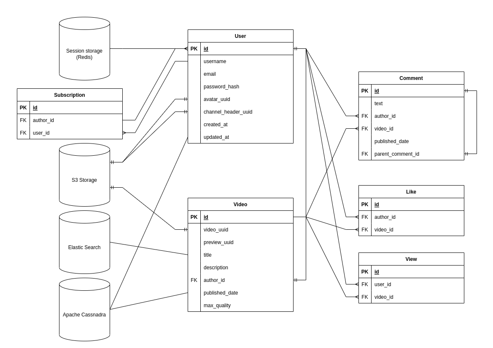
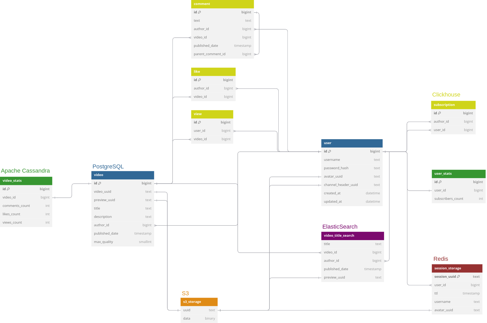
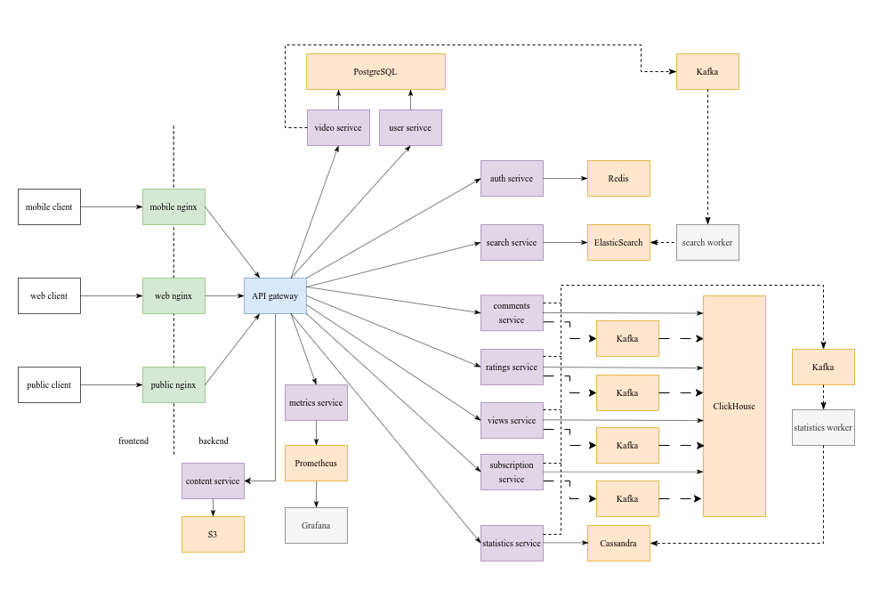

# YouTube
Курсовой проект по дисциплине "Проектирование высоконагруженных систем" VK Education в МГТУ.

## Содержание
1. [Тема и целевая аудитория](#1-тема-и-целевая-аудитория)
2. [Расчет нагрузки](#2-расчет-нагрузки)
3. [Глобальная балансировка нагрузки](#3-глобальная-балансировка-нагрузки)
4. [Локальная балансировка нагрузки](#4-локальная-балансировка-нагрузки)
5. [Логическая схема БД](#5-логическая-схема-бд)
6. [Физическая схема БД](#6-физическая-схема-бд)
7. [Алгоритмы](#7-алгоритмы)
8. [Технологии](#8-технологии)
9. [Обеспечение надежности](#9-обеспечение-надежности)
10. [Схема проекта](#10-схема-проекта)
11. [Список серверов](#11-список-серверов)
12. [Источники](#источники)

## 1. Тема и целевая аудитория
YouTube - видеохостинг, предоставляющий своим пользователям возможность просмотра, оценки, комментирования и загрузки видео.

### Ключевой функционал 
- Список рекомендованных видео
- Поиск видео
- Просмотр видео
- Загрузка видео
- Добавление комментариев к видео
- Оценка видео посредством лайков
- Подписка на автора контента

### Целевая аудитория
Видеохостинг имеет 2,7 миллиарда активных пользователей в месяц [1].
Данные о месячной аудитории по странам представлены в таблице.

| Страна    | Количество пользователей в месяц, млн |
| --------- | ------------------------------------- |
| Индия     | 476                                   |
| США       | 238                                   |
| Бразилия  | 147                                   |
| Индонезия | 139                                   |
| Россия    | 95,4 [2]                              |
| Мексика   | 84,2                                  |
| Япония    | 79,4                                  |
| Пакистан  | 66,1                                  |
| Германия  | 65,7                                  |
| Вьетнам   | 63                                    |

## 2. Расчет нагрузки
### Продуктовые метрики
- 122 млн. активных пользователей в день (DAU) [1]
- 2,7 млрд. активных пользователей в месяц (MAU) [1]
- Среднее время просмотра - 19 минут в день [3]
- На сервисе размещено 4 млрд. видео [4]. Их суммарная длительность: 12,5 мин / 60 мин * 4 млрд = 800 млн. часов
- Каждую минуту на YouTube загружается 360 часов видео [4]
- Среднее видео длится 12,5 минут [4]
- Среднее видео набирает 5600 просмотров [5]
- 5 из 1000 пользователей оставляют комментарий к видео [6]
- 40 из 1000 пользователей оставляют оценку к видео [6]

### RPS по типам запросов
Предположим, что пользователь посещает страницу рекомендаций 2 раза в день и 1 раз в день производит поиск видео. Такой вывод можно сделать, если исходить из того, что среднее видео длится 12,5 минут, а пользователь проводит на видеохостинге 19 минут в день. В таком случае он должен дважды открыть видео, что чаще всего делают со страницы рекомендаций.

Пусть видео отдаются пользователю блоками размером в 1 минуту.

Среднее количество видео, которое все пользователи загружают на видеохостинг в день: 360 часов * 60 * 24 / 12,5 минут = 2 488 320.

Предположим, что пользователь подписывается на новые каналы 5 раз в год.

Рассчитаем средний RPS как (количество запросов в день на пользователя) * DAU / 86 400 с.

| Тип запроса         | Количество запросов в день на пользователя | Средний RPS   | Пиковый RPS |
| ------------------- | ------------------------------------------ | ------------- | ----------- |
| Список рекомендаций | 2                                          | 2 824         | 7 060       |
| Поиск видео         | 1                                          | 1 412         | 3 530       |
| Просмотр видео      | 19                                         | 26 828        | 67 070      |
| Загрузка видео      | 0,02                                       | 28            | 70          |
| Комментарий         | 0,005                                      | 8             | 20          |
| Оценка видео        | 0,04                                       | 60            | 150         |
| Оформление подписки | 0,015                                      | 21            | 52          |
| Суммарно за день    | 22,041                                     | 31 181        | 77 952      |

### Технические метрики
- Один час FHD видео на YouTube в среднем весит 4 Гб, HD - 2,5 Гб, 480p - 0,68 Гб [7]. Исходя из этого, можно расчитать, что видео в качестве 360p будут весить 0,38 Гб, 240p - 0,17 Гб, 144p - 0,06 Гб.
- Расчитаем размер хранилища для видео с учетом того, что они сохранются в шести вышеперечисленных разрешениях
- Размер пользовательского хранилища составляет 1 Мб

### Объем сохраняемых данных
| Тип данных           | Средний размер единицы данных | Количество данных | Размер данных |
| -------------------- | ----------------------------- | ----------------- | ------------- |
| Профиль пользователя | 1 Мб/шт                       | 2,5 млрд. шт      | 2 384 Тб      |
| Видео                | 7,79 Гб/час                      | 800 млн. часов    | 5 942 Пб      |
| Комментарии          | 1 Кб/шт                     | 44 млрд. шт       | 41 Тб          |

### Сетевой трафик
| Тип запроса         | Трафик на одно действие | Пиковый RPS | Пиковый трафик, Гбит/с | Суммарный суточный трафик, Гбайт/сутки |
| ------------------- | ----------------------- | ----------- | ---------------------- | -------------------------------------- |
| Список рекомендаций | 2 Мб                    | 7 060       | 110                    | 476 550                                |
| Поиск видео         | 2 Мб                    | 3 530       | 55                     | 238 275                                |
| Просмотр видео      | 68 Мб                   | 67 070      | 35 630                 | 153 925 650                            |
| Загрузка видео      | 853 Мб                  | 70          | 466                    | 2 015 212                              |

### Прирост данных за год
- Средний годовой прирост MAU видеохостинга на протяжении последних 10 лет составлял 200 млн. пользователей [8]
- Прирост видео за год: 360 часов * 60 * 24 * 365 = 189 млн. часов

| Тип данных           | Средний размер единицы данных | Прирост единицы данных | Прирост данных |
| -------------------- | ----------------------------- | ---------------------- | -------------- |
| Профиль пользователя | 1 Мб/шт                       | 200 млн. шт            | 190 Тб         |
| Видео                | 7,79 Гб/час                   | 189 млн. часов         | 1 400 Пб       |

## 3. Глобальная балансировка нагрузки
### Функциональное разбиение по доменам
Целесообразно будет вынести в отдельный домен сервис для отправки видео клиенту, так как на этот тип запроса приходится более большая часть трафика.

### Расположения CDN
Так как видеохостинг широко используется во всем мире, необходимо иметь точки присутствия (POP) во всех частях света, а также несколько POP в странах, которые находятся в списке 10 стран с самым большим MAU (см. таблицу в пункте 1). Размещать POP следует с учетом числа людей [9] и плотности населения в разных странах.

| Регион           | Местоположение POP | Обоснование выбора местоположения |
| ---------------- | ----------------- | --------------------------------- |
| Северная Америка | Атланта, Лос-Анджелес, Денвер, Мехико, Оттава | Первые три POP будут обслуживать трафик в США, POP в Атланте и Мехико также смогут принимать трафик из Мексики. Последний нужен для Канады, а также Севера США. |
| Южная Америка    | Богота, Буэнос-Айрес, Бразилиа | POP в Боготе будет служить для обслуживания Латинской Америки, POP в Буэнос-Айресе - для обслуживания южной и западной части континента. Точка в Бразилиа будет нужна для обслуживания Бразилии. |
| Африка и Ближний Восток | Йоханнесбург, Каир    | Африка - регион с низким проникновением интернета, ни одна страна из этой части света не входит в вышеуказанный список, поэтому имеет смысл поставить POP на севере и на юге континента. POP в Каире также сможет обслуживать Ближний Восток. |
| Океания          | Дарвин, Сидней, Сингапур | Первые два POP будут обслуживать Юг и Север Австралии соответственно, а также Папуа. Остальные необходимы как для обсуживания всей Океании, так и для Индонезии (4 место в списке по MAU). |
| Азия             | Тайбэй, Токио, Ханой | Первый POP необходим для Тайваня и близлежащих островов. Остальные POP равномерно распределены по Азии. |
| Индия и Пакистан | Мумбаи, Нагпур, Калькутта, Нью-Дели, Мултан | Эти две страны вынесены отдельно, так как географически они близки друг к другу, а также Индия занимает первое место по месячной аудитории (476 млн. чел.) В связи с этим была необходимость в том, чтобы разместить в Индии 4 POP, которые будут равноудалены друг от друга. Также POP в Нью-Дели смогут пользоваться соседние страны с низким охватом интернета (Непал, Бангладеш). POP в Пакистане смогут также обслуживать Ближний Восток. |
| Россия и Европа | Эдинбург, Берлин, Рим, Стамбул, Москва, Санкт-Петербург, Новосибирск | POP в Санкт-Петербурге будет обслуживать Европейский Север и Финляндию, в Москве - центральную и южную часть. POP в Новосибирске нужен для обслуживания Сибири и Дальнего Востока соответственно. Оставшиеся POP равномерно распределены по Европе с учетом плотности населения. Отдельный POP нужен Германии, как стране с MAU 65,7 млн. человек. |

### Расположения ДЦ
| Регион           | Местоположение ДЦ | Обоснование выбора местоположения |
| ---------------- | ----------------- | --------------------------------- |
| Северная Америка | Денвер | ДЦ будет обслуживать весь континент. |
| Южная Америка    | Бразилиа | Преназначен для обслуживания Южной и Латинской Америки |
| Африка и Ближний Восток | Йоханнесбург | ДЦ будет обслуживать южную и центральную Африку. Запросы из северной Африки могут уходить на него же, либо в Европу. |
| Океания          | Дарвин | Будет целиком обслуживать Австралию и Юг Океании |
| Азия             | Ханой | Обслуживание всей западной части Азии, а также резерв на случай выхода из строя ДЦ в Австралии. |
| Индия и Пакистан | Нью-Дели | Будет принимать запросы из Индии, Пакистана, а также стран, которые граничат с ними с Севера. |
| Россия и Европа  | Берлин, Новосибирск | ДЦ в Берлине предназначен для обслуживания Европы и стран Кавказа. Второй будет принимать запросы из азиатской части России. |

### Карта с POP и ДЦ
Ниже представлена карта с расположением всех ДЦ и точек присутствия CDN. Первые объекты обозначены красным цветом, вторые - зеленым.

### Расчет распределения запросов по ДЦ
Общее количество POP - 28, ДЦ - 8. Определим распределение запросов по разным регионам, исходя из следующих пропорций (MAU стран части света / общее MAU):
- Северная Америка - 15%
- Южная Америка - 10%
- Африка и Ближний Восток - 10%
- Океания - 10%
- Азия - 10%
- Индия и Пакистан - 20%
- Россия и Европа - 25%

| Регион                  | Общий RPS (без загрузки видео) | RPS на загрузку видео | RPS на один ДЦ | RPS на один POP |
| ----------------------- | ------------------------------ | --------------------- | -------------- | --------------- |
| Северная Америка        | 644,1                          | 4024,2                | 644,1            | 804,9             |
| Южная Америка           | 429,4                          | 2682,8                | 429,4          | 894,2           |
| Африка и Ближний Восток | 429,4                          | 2682,8                | 429,4          | 1341,4          |
| Океания                 | 429,4                          | 2682,8                | 429,4          | 894,2          |
| Азия                    | 429,4                          | 2682,8                | 429,4          | 894,2           |
| Индия и Пакистан        | 858,8                          | 5365,6                | 858,8          | 1073,1           |
| Россия и Европа | 1073,5                          | 6707                | 536,8          | 958,1           |

### Схема DNS-балансировки
Ввиду того, что все ДЦ распределены по планете, будет логично использовать Geo-Based DNS, так каждый пользователь сможет осуществлять роутинг к ближайшему датацентру.

### Схема Anycast-балансировки
Geo-Based DNS поможет определить локацию ближайшего ДЦ или POP, однако это не поможет в случае выхода одного из них из строя, поэтому в каждом из вышеуказнных регионов необоходимо поставить BGP Anycast для распределения трафика.

## 4. Локальная балансировка нагрузки
### Балансировка входящих запросов
- Равномерное распределение входящих запросов между серверами с помошью Weighted Round Robin. Это можно использовать для низкой интенсивности запросов, то есть для всех запросов, кроме просмотра видео
- Направление запросов на сервер с наименьшим количеством активных подключений с использованием Least Connections. Это оптимально для интенсивных операций, таких как просмотр видео, когда нагрузка на серверы варьируется
- Балансировка входящих запросов будет осуществляться на уровне L7 с помощью балансировщика Nginx

### Балансировка межсервисных запросов
Для распределения межсервисных запросов используется Nginx, настроенный как обратный прокси-сервер. Он направляет запросы к сервисам на основе алгоритма Least Connections или Weighted Round Robin, в зависимости от типа нагрузки.

 Также Nginx можно интегрировать с Kubernetes для учёта состояния контейнеров, что позволяет оптимизировать маршрутизацию запросов.

### Схема отказоустойчивости
- Healthcheck сервера при помощи встроенныех средств Kubernetes
- Развертывание нескольких экземпляров серверов и кластеров Kubernetes в каждом регионе, чтобы в случае сбоя одного из компонентов нагрузка перераспределялась на доступные серверы
- Для критически важных сервисов и данных следует настроить механизмы failover, при которых трафик перенаправляется на резервные кластеры или узлы. Репликация данных между датацентрами минимизирует потери в случае сбоя
- Настройка таймаута на основе квантилей - если запрос с одной машины будет отвечать дольше, чем 95% других запросов, то такое соединение будет закрываться и будет происходить установка нового, с менее загруженным сервером

### Нагрузка по терминации SSL
- Для снижения нагрузки будем использовать кеширование сессий. Это обеспечит сокращение количества дорогостоящих операций с RSA обменом ключей
- Снижение нагрузки будет осуществляться на уровне веб-сервера, например, Nginx
- Будем использовать несколько веб-серверов (по 5 на ДЦ), чтобы не прерывать работу в случае выхода одного из них из строя
- После обмена ключей на уровне веб-сервера запросы в ДЦ будут использовать протокол HTTP

## 5. Логическая схема БД
### Схема

### Описание
- В таблице User будут храниться данные о пользователе: его почта, имя, хеш пароля, время создания и обновления аккаунта
- В таблице Video будут храниться данные о видео: заголовок, описание и дата публикации
- Для записи информации о комментариях, подписках, оценках и просмотрах будем использовать отдельные таблицы с полями, которые буду ссылаться на id пользователя или видео таблицы Video или User соответственно
- В таблице с комментарием также будет содержаться id родительского комментария, если данный комментарий является ответом на другой
- Для снижения нагрузки на реляционную БД вынесем поля с количеством комментариев, лайков и просмотров конкретного видео в СУБД Cassandra (см. Физическую схему БД)
- Аналогично для количества подписчиков у канала
- Для хранения видео, их превью, аватаров пользователей, а также изображений с шапкой канала будем использовать S3-хранилище
- При этом в реляционную СУБД будем записывать UUID видео или изображения, по которому впоследствии можно будет установить соответствие между запрашиваемыми данными и их положением в хранилище
- Максимальная длина электронной почты согласно RFC 5321 сотавляет 320 символов [10]
- Максимальная длина комментария и описания к видео на видеохостинге составляет 5000 символов [11][12]
- Максимальная длина заголовка видео - 100 символов [12]

### Типы и размер данных
#### User
 - id - BIGINT (8 байт)
 - username - TEXT (30 байт)
 - email - TEXT (320 байт)
 - password_hash - TEXT (256 байт)
 - avatar_uuid - TEXT (4 байта)
 - channel_header_uuid - TEXT (4 байта)
 - created_at - DATETIME (8 байта)
 - updated_at - DATETIME (8 байта)

 Итого: 650 байт на одного пользователя без учета аватара и шапки канала

 Суммарный объем данных: 650 байт * 2,7 млрд. пользователей = 1,6 Тб

 #### Video
 - id - BIGINT (8 байт)
 - video_uuid - TEXT (16 байт)
 - preview_uuid - TEXT (16 байт)
 - title - TEXT (100 байт)
 - description - TEXT (5000 байт)
 - author_id - BIGINT (8 байт)
 - published_date - TIMESTAMP (8 байт)
 - max_quality - SMALLINT (2 байта)

Итого: 5158 байт на данные одного видео без самого видео и его превью

Суммарный объем данных: 5158 байт * 4 млрд. видео = 18,8 Тб

#### Comment
- id - BIGINT (8 байт)
- text - TEXT (5000 байт)
- author_id - BIGINT (8 байт)
- video_id - BIGINT (8 байт)
- published_date - TIMESTAMP (8 байт)
- parent_comment_id - BIGINT (8 байт)

Итого: 5040 байта на один комментарий

Суммарный объем данных: 5040 байт * 0,005 * 4 млрд. видео * 5600 = 512,5 Тб

Здесь 0,005 - процент пользователей, которые оставляют комментарии, 5600 - среднее количество просмотров у видео

#### Like
 - id - BIGINT (8 байт)
 - author_id - BIGINT (8 байт)
 - video_id - BIGINT (8 байт)

Итого: 24 байта на один лайк

Суммарный объем данных: 24 байта * 0,04 * 4 млрд. видео * 5600 = 20 Тб

Здесь 0,04 - процент пользователей, которые оставляют лайки, 5600 - среднее количество просмотров у видео

#### Subscrption
 - id - BIGINT (8 байт)
 - author_id - BIGINT (8 байт)
 - user_id - BIGINT (8 байт)

Итого: 24 байта на одну подписку

Суммарный объем данных: 24 байта * 5 * 2,7 млрд. чел. * 10 = 3 Тб

Здесь 5 - среднее количество каналов, на которые пользователь подписывается за год, 10 - время, в течение которого аудитория YouTube превышала 2 млрд. человек

#### View
 - id - BIGINT (8 байт)
 - user_id - BIGINT (8 байт)
 - video_id - BIGINT (8 байт)

Итого: 24 байта на один просмотор

Суммарный объем данных: 24 байта * 5600 * 4 млрд. видео = 489 Тб

Здесь 5600 - среднее количество просмотров у одного видео

### Нагрузка на чтение и запись
- Рассчитаем нагрузку на чтение данных пользователя исходя из того, что запросы происходят при каждом переходе между страницами, а также при загрузке видеоролика. Таким образом, если средний пользователь посещает 2 страницы рекомендаций, 1 страницу поиска и 2 страницы видео в день, то среднее количество запросов в день на одного пользователя составляет 5. Тогда нагрузка на БД в секунду - 5 * DAU / 86400 с.
- При расчете нагрузки на запись данных пользователя примем во внимание, что ежегодный прирост новых пользователей составляет 200 млн. Тогда RPS на запись - 200 млн. / (365 * 24 * 3600 с).
- Средний пользователь смотрит 2 видео, следовательно, дважды в день читает информацию о видео из БД. Тогда нагрузка на чтение - 2 * DAU / 86400. Помимо этого надо учесть обновление таблицы при обновлении количества подписок у пользователя.
- Предположим, что средний пользователь смотрит 10 комментариев у одного видео. Тогда нагрузка на чтение комментариев будет в 10 раз больше, чем нагрузка на чтение данных видео.
- Так как в таблице с информацией о видео существует поле с количеством лайков видео, то производить чтение из таблицы с лайками нужно убдет производить только при загрузке видео для проверки того, что конкретный пользователь еще не оставлял оценку данному видео. Таким образом, нагрузка на чтение для этой таблицы будет аналогична нагрузке на чтение из таблицы Video.
- Аналогично с таблицей подписок и просмотров.
- Нагрузка на запись для таблицы просмотров должна быть равна нагрузке на чтение из таблицы Video, если исходить из предположения, что пользователь каждый день смотрит те видео, которые еще не смотрел ранее
- Все остальные данные в таблице рассчитаны с опором на таблицу RPS из 2 пункта курсовой работы.

| Таблица      | Размер единицы данных | Нагрузка на чтение, RPS | Нагрузка на запись, RPS |
| ------------ | --------------------- | ----------------------- | ----------------------- |
| User         | 650 байт              | 7060                    | 21,6 (21 из них - обновление числа подписок)                    |
| Video        | 5158 байт             | 2824                    | 96 (68 из них - обновление числа лайков и комментариев)                      |
| Comment      | 5040 байт             | 2824                    | 8                       |
| Like         | 24 байта              | 2824                    | 60                       |
| Subscription | 24 байта              | 2824                    | 21                      |
| View         | 24 байта              | 2824                    | 2824 |

## 6. Физическая схема БД
### Схема

### Выбор СУБД
Для хранения таблиц User и Video будем использовать реляционную СУБД PostgreSQL, так как нагрузка на запись для данных таблиц является небольшой, а нагрузку на чтение можно уменьшить посредством масштабирования и шардирования БД.

Для хранения данных пользовательских сессий будем использовать СУБД Redis. Она позволит осуществлять быстрый поиск ID пользователя по ID сессии за счет того, то ее данные храняется в оперативной памяти. Отказоустойчивость будет обеспечиваться за счет встроенной поддержки репликации.

Для хранения количества лайков, комментариев и просмотров видео, а также количества подписчиков канала будем использовать Apache Cassandra. Данная СУБД значительно снизит нагрузку на запись в PostgreSQL, а также позволит обспечить высокую скорость записи и обновления большого количества данных.

Для осуществления быстрого поиска по заголовку видео будем использовать СУБД ElasticSearch, в которой будет храниться заголовок видео, его автор, дата публикации и UUID в S3-хранилище. Такой подход позволит обеспечить быстрый поиск всех данных о видео, которые необходимо отобразить на странице поиска. Обновление таблицы будет проихсходить с использованием специального воркера, который будет читать раз в некоторое время данные из Apache Kafka, куда они будут поступать при загрузке видео.

Для хранения таблиц Comment, Like, Subscription и View будем использовать СУБД ClickHouse. Она обеспечит быструю скорость записи и чтения данных (в том числе при загрузке комментариев блоками). Из всех вышеуказанных таблиц обновление может трбеовать только таблица Comment при добавлении ответа на комментарий, следовательно, отсутствие точечных обновлений у СУБД не должно стать узким местом. 

### Денормализация
Денормализация была проведена в прошлом пункте. С этой целью были созданы таблицы video_stats и user_stats в Apache Cassandra.

### Индексы
Добавим индексы на следующие поля таблиц ClickHouse:
- Subscription.author_id и Subscription.user_id - каждый раз при загрузке видео или страницы автора требуется проверка на наличие подписки пользователя на конкретного автора
- Like.author_id и Like.video_id - аналогично предыдущему пункту, но для проверки наличия оценки видео пользователем
- View.video_id и View.author_id - для проверки наличия просмотора у пользователя
- Comment.video_id - запрос на отображение списка комментариев для конкретного видео
- Comment.parent_comment_id - запрос на отображение ответов к данному комментарию

Добавим B-tree индексы для поля author_id таблицы видео в СУБД PostgreSQL. Он будет предназначен для ускорения обработки запроса на отображение списка видео для конкретного автора

### Шардирование и резервирование СУБД
#### PostgreSQL
Применим шардирование для таблиц Video и User. Распределять по шардам будем на основе первичного ключа для User, а также внешнего ключа author_id для таблицы Video. Используем при этом следующий алгоритм:
- Вычисляем хеш от необходимого ключа
- Определяем по нему номера шарда, как остаток деления хеша на число шардов
- Производим операцию по номеру нужного шарда

Будем применять репликацию по схеме master-slave с использованием трех синхронных slave-узлов. Такая схема поможет сохранить данные в случае отказа master-сервера. Репликация будет производиться для таблиц Video и User, так как в них хранятся наиболее важные для работы сервиса данные.

#### Redis
Для настройки шардирования воспользуемся встроенным механизмом Redis Cluster, который по ключу определяет шард, на котором хранятся конкретные данные.

Будем применять репликацию по схеме master-slave с использованием двух асинхронных slave-узлов. Данная схема позволит прочитать данные о сессии пользователя даже в случае отказа одного узлов, что является критически важным для приложения, в котором многое ориентировано на наличие авторизации у пользователя.

#### Apache Cassandra
Настроим шардирование для таблиц User_stats и Video_stats с помощью встроенных в СУБД Cassandra средств. Распределение по шардам будем производить на основе внешних ключей user_id и video_id соответственно.

Будем применять репликацию по схеме master-slave с использованием двух синхронных slave-узлов. Данная практика позволит производить корректный подсчет статистики видео и пользователя даже при отказе одного узла.

#### ElasticSearch
Для настройки шардирования в ElasticSearch разобьем индекс на несколько щардов с помощью внутренних средств СУБД. Это поможет ускорить поиск видео по их заголовку, так как сузит объем данных.

Также настроим репликацию с выделением одной реплики каждому шарду. Это можно сделать с использованием средств ElasticSearch Cluster.

#### ClickHouse
Будем шардировать таблицы Comment, Like и View, так как у них предполагается самый большой объем данных. Для разделения по шардам будем использовать video_id для таблиц Comment и Like и user_id для View.

Настроим репликацию для таблицы Comment по схеме master-slave. Возможность комментирования является одной из важных особенностей приложения и поэтому стоит защищать комментарии от потери в случае отказа одного из узлов. 

### Клиентские библиотеки / интеграции
Будем писать серверную часть приложения на языке Go, так как этот язык обладает множеством библиотек с поддержкой различных СУБД. В данном случае можно для подключения использовать следующие, как самый распространенные варианты:
- PostgreSQL - [pgx](https://github.com/jackc/pgx)
- Redis - [go-redis](https://github.com/redis/go-redis)
- Apache Cassandra - [cassandra-gocql-driver](https://github.com/apache/cassandra-gocql-driver)
- ElasticSearch - [go-elasticsearch](https://github.com/elastic/go-elasticsearch)
- ClickHouse - [clickhouse-go](https://github.com/ClickHouse/clickhouse-go)

### Балансировка запросов / мультиплексирование подключений
- Будем использовать PgBouncer для балансировки запросов к PostgreSQL, а также настройки репликации
- Для настройки шардирования и репликации Redis будем использовать Redis Cluster
- Будем использовать встроенные средства Apache Cassandra для балансировки запросов
- Для настройки шардирования и репликации ElasticSearch будем использовать ElasticSearch Cluster
- Балансировку запросов к ClickHouse можно осуществлять с помощью встроенных средств СУБД

### Схема резервного копирования
- Для PostgreSQL настроим резервное копирование с использованием WAL. Это позволит создавать резервные копии без остановки работы сервера и восстанваливать состояние БД на любой момент времени
- Redis использует механизм AOF (Append Only File), который схож с WAL в PostgreSQL. AOF позволяет создавать резервные копии без остановки работы сервера и восстанавливать состояние базы данных на любой момент времени
- По аналогии с предыдущими двумя пунктами у Apache Cassandra имеется механизм, который позволяет создавать снапшот памяти в любой момент времени без остановки работы БД 
- То же самое справедливо и для ClickHouse
- Для настройки резервного копирования ElasticSearch можно использовать сторонние библиотеки

## 7. Алгоритмы
### Алгоритм сохранения нового видео
1. При загрузке нового видео генерируется UUID, который позволит однозначно идентифицировать видео в S3-хранилище
2. Загруженное видео кодируется в нескольких разрешениях (начиная с исходного разрешения видео и закнчивая самым низким - 144p)
3. В S3-хранилище видео, название которой содержит UUID видео
4. При запросе видео сервер получает информацию о его ID в реляционной СУБД, предпочтительное разрешение, а также фрагмент, с которого необходимо начать загрузку видео
5. По этой информации определяется положение видео в S3-хранилище, после чего происходит отправка на клиент одной минуты видео, начиная с указанного фрагмента времени

### Алгоритм подбора рекомендаций
1. Для работы алгоритма необходима информация о том, каким видео пользователь ставил оценки и на каких авторов подписывался. Также можно сохранять историю поисковых запросов пользователя для улучшения качества рекомендательной системы
2. Для правильного подбора рекомендаций можно учитываь текущее местоположение пользователя
3. Все загруженные видео необходимо анализировать, чтобы выявлять их тематику или производить кластеризацию по каким-либо другим признакам
4. На основе вышеперечисленных сведений рекомендательная система будет подбирать тот контент, который может понравиться пользователю
5. Также можно добавлять видео из смежных категорий чтобы не ограничивать пользователя одними и теми же темами

### Алгоритм модерации контента
1. Загруженное видео или комментарий анализируется нейросетью на предмет наличия запрещенного площадкой контента
2. В случае выявления такового пользователю отказывают в публикации видео или комментария

Первичное обучение нейросетей, которые будут осуществлять подбор рекомендаций и модерацию контента можно производить на основе выборки, полученной с аналогичных сервисов. Для дальнейшего обучения, а также работы необходимо выделить дополнительные мощности в каждом ДЦ. 

## 8. Технологии
| Технология    | Область применения  | Мотивационная часть |
| ------------- | ------------------- | ------------------- |
| TypeScript    | Frontend            | Скриптовый язык со статической типизацией. Поддерживается всеми бразуерами, поэтому приложения, написанные на нем, можно использовать без ограничений. |
| React         | Frontend             | Расширяет функционал TS. Используется для создания динамического поведения веб-страниц.    |
| Kotlin        | Мобильное приложение | Язык, который позволит создать мобильное приложение под Android. |
| Swift         | Мобильное приложение | Язык, который позволит создать мобильное приложение под iOS |
| Golang        | Backend              | Язык программирования, который заточен под написание веб-приложений, а также показывает высокую производительность в различных сценариях работы. Имеет множество библиотек, которые помогут настроить взаимодействие как с клиентом, так и с базами данных. |
| Python        | Backend              | Имеет множество библиотек для машинного обучения. Данный язык программирования можно использовать для создания рекомендательной системы, а также системы фильтрации контента. |
| PostgreSQL    | Основная СУБД        | СУБД поставляет большой функционал, высокую надежность, а также имеет расширения для шардирования и репликации. |
| Redis         | Хранений сессий      | In-memory СУБД позволит обеспечить высокую скорость чтения и записи для приложения, в котором многое ориентировано на наличие авторизации у пользователя. |
| ElasticSearch | Поиск по видео       | СУБД обеспечивает большую скорость индексирования и гибкий функционал для настроек таблиц, что позволит значительно ускорить поиск в приложении. |
| Apache Cassandra | Хранение статистики видео и пользователя | СУБД позволит обеспечить быструю скорость чтения и обновления тех данных, которые являются критически важными для приложения, а именно статистики видео и пользователя. Важным преимуществом является встроенная поддержка шардирования и репликации. |
| ClickHouse | Хранение больших таблиц | Колоночная СУБД. Может быть использована для хранения большого объема данных, которые часто читаются и записываются, но редко обновляются. Позволяет обеспечить высокую скорость чтения для больших объемов данных. Есть встроенная поддержка репликации и шардирования |
| Prometheus | Хранение метрик | Гибкая система для сбора и хранения метрик приложения. |
| Grafana    | Визуализация метрик | Позволяет создавать большое количество дашбордов для лучшей визуализации метрик и текущего состояния приложения. |
| Nginx      | Reverse-proxy | Быстрое и популярное решение в области веб-серверов. Позволит обеспечить стабильную работу приложения благодаря возможности балансировать нагрузку между серверами. |
| Git        | Система контроля версий | Позволит обеспечить совместную работу над приложением. |
| GitLab/GitHub | Хранение удаленных репозиториев | Расширяет функционал Git возможностью делиться своими репозиториями удаленно. Также поддерживает удобную настройку CI/CD. |
| Kubernetes | Развертывание приложения | Инструмент для оркестрации, масштабирования и поддержания отказоустойчивости приложения. |

## 9. Обеспечение надежности
### Backend
Для обеспечения отказоустойчивости и устойчивости к нагрузкам в сервисе используется Kubernetes.
- Контейнеры автоматически перезапускаются в случае сбоев.
- Kubernetes управляет распределением ресурсов между узлами, чтобы поддерживать стабильную работу сервиса даже при высокой нагрузке, распределяя запросы к API.
- Сервисы обновляются поэтапно, чтобы избежать полной остановки, поддерживая стабильность работы платформы для пользователей.

### Базы данных
- Используется механизм асинхронной репликации для хранения копий данных на нескольких серверах. Это позволяет оперативно переключаться на реплику в случае сбоя основного узла и поддерживать доступность данных.
- Регулярное создание резервных копий данных позволяет восстанавливать базу после сбоев или ошибок с минимальной потерей данных.
- Для распределения нагрузки и повышения масштабируемости крупные таблицы разделены на шарды. Это позволяет обрабатывать запросы к таким нагруженным таблицам, как таблицы с лайками, комментариями и просмотрами.
- Кластеры баз данных позволяют поддерживать несколько узлов для обработки запросов. В случае сбоя одного из узлов кластер автоматически перенаправляет запросы на работающие узлы.
- Для снижения нагрузки на базу данных используется система кэширования, хранящая часто запрашиваемые данные в оперативной памяти.
- Более подробное описание можно найти в 6 пункте работы.

### Мониторинг работы сервиса
- Все запросы и ответы сервиса логируются для отслеживания причин возможных сбоев.
- Для хранения метрик, таких как задержка загрузки видео, ошибки на страницах, время отклика API и объемы запросов можно использовать Prometheus. Эти данные визуализируются в Grafana, что позволяет в режиме реального времени наблюдать за состоянием системы.
- При отклонении от нормальных значений метрик отправляются автоматические оповещения, что позволяет оперативно отреагировать на сбои в работе сервиса.

### Асинхронные паттерны
- Применим паттерн CQRS для записи в нагруженные таблицы (Like, Comment, View и Subscription). Это позволит сделать запись в базу данных асинхронной и снизить нагрузку на чтение. 
- Для реализации будем использовать брокер сообщений Kafka, а также специальный воркер, который будет производить запись в БД раз в некоторый промежуток времени.
- При проведении распределенных транзанкций будем использовать двухфазный коммит для поддержания согласованности данных.

### Физический уровень надежности
- Для обеспечения бесперебойного питания в ДЦ можно установить резервные источники питания, которые будут обслуживать сервера в случае энергетического сбоя
- Установим в ДЦ оборудование уровня обслуживания Tier III. Датацентры такого уровня простаивают менее 1,6 часа в год [13], что является очень хорошим показателем. Также можно отметить возможность обслуживания без отключения сервера - это позволит обеспечить своевременную профилактику оборудования незаметно для клиентов.

### Прочие инструменты обеспечения надежности
- Система развернута в нескольких центрах обработки данных в разных регионах для обеспечения непрерывности работы при локальных сбоях, снижении сетевой задержки и повышении качества обслуживания.
- При завершении работы сервисов должна выполняться корректная обработка всех активных запросов для предотвращения потери данных (Graceful shutdown).
- Настройка таймаута на основе квантилей для переключения слишком долгих запросов на менее загруженные сервера.
- Для обеспечения защиты от атак, а также работы с защищенным соединением можно использовать любой прокси-сервер, например, Nginx.

## 10. Схема проекта

### Пояснения к схеме
Сплошными линиями на схеме обозначены синхронные взаимодействия, а пунктирными - асинхронные

Запись данных о лайках, просмотрах, комментариях и подписках будем производить с использованием брокера сообщений Apache Kafka, чтобы можно было вставлять их батчами, уменьшив таким образом нагрузку на СУБД

| Сервис | Функционал |
| ------ | ---------- |
| video service | Взаимодействие с данными видео (описание, дата загрузки, название и т.д.) |
| user service | Взаимодействие с данными пользователя |
| auth service | Проверка авторизации и получение данных текущей сессии |
| search service | Поиск по названию видео |
| comments service | Добавление и получение комментариев |
| ratings service | Добавление лайка и проверка на его наличие |
| views service | Добавление просмотра и проверка на его наличие  |
| subscription service | Оформление подписки и проверка на ее наличие |
| statistics service | Получение статистики пользователя или видео |
| metrics service | Сбор метрик приложения |
| content service | Загрузка контента |

## 11. Список серверов
### Базовый расчет аппаратных ресурсов
- Будем рассчитывать нагрузку на один сервис как отношение RPS этого сервиса на все ДЦ к их количеству, умноженное на 2,5 (для учета пиковой нагрузки).
- Nginx способен обрабатывать до 38 400 HTTPS-запросов на 8 ядрах [15]. Этого будет достаточно для поддержания работоспособности приложения.
- При расчете RPS на ElasticSearch будем исходить из того, что он складывается из чтения (поиска видео) и записи данных батчами (например, по 100 строк в одном батче).
- Аналогично для Cassandra и ClickHouse.
- Рассчитаем объем оперативной памяти, которую необходимо выделить под Redis. Для этого предположим, что в нем будет храниться удвоенное количество MAU, то есть 5,4 млрд. записей. Каждая запись занимает 50 байтов, тогда необходимый объем RAM для одного хранилища - 32 Гб.
- Для текущего значения RPS на СУБД PostgreSQL будет достаточно 32 ядер процессора [16]. Также необходимо учитывать, что индексы таблиц должны помещаться в оперативную память. Так как индексируется одно 8-ми байтовое поле таблицы на 4 млрд. записей, то с учетом служебной информации (24 байта) получаем 120 Гб. Так как данные будут распределяться по трем шардам, то все полученные значения можно поделить на 3.
- Для расчета RAM под СУБД будем брать запас в 50%.
- Данные для СУБД приведены на один узел.

От характера сервиса зависит то, сколько ресурсов он будет потреблять. Рассчитаем ресурсы для серверов разной сложности следующим образом:
- Легкая бизнес-логика - 1 CPU на 100 RPS, 1 Гб RAM на 1000 RPS
- Средняя бизнес-логика - 1 CPU на 50 RPS, 2 Гб RAM на 1000 RPS
- Тяжелая бизнес-логика - 1 CPU на 25 RPS, 4 Гб RAM на 1000 RPS

|    Сервис     |    RPS    |   Характер сервиса    |    CPU    |    RAM    |
| ------------- | --------- | --------------------- | --------- | --------- |
| API gateway   | 8661      | Легкая бизнес-логика  | 87        | 10 Гб      |
| video         | 883       | Средняя бизнес-логика | 18        | 2 Гб      |
| user          | 813       | Средняя бизнес-логика | 17        | 2 Гб      |
| auth          | 3753      | Легкая бизнес-логика  | 38        | 4 Гб      |
| search        | 980       | Тяжелая бизнес-логика | 40        | 4 Гб      |
| comments      | 786       | Средняя бизнес-логика | 16        | 2 Гб      |
| ratings       | 793       | Средняя бизнес-логика | 16        | 2 Гб      |
| views         | 1570      | Средняя бизнес-логика | 40        | 2 Гб      |
| subscriptions | 788       | Средняя бизнес-логика | 16        | 2 Гб      |
| statistics    | 1626      | Средняя бизнес-логика | 33        | 4 Гб      |
| Nginx         | 19560     | -                     | 8         | 40 Гб     |
| Redis         | 1877      | -                     | 18        | 30 Гб     |
| PostgreSQL    | 566       | -                     | 12        | 75 Гб     |
| ElasticSearch | 486       | -                     | 7         | 75 Гб     |
| ClickHouse    | 1050      | -                     | 16        | 150 Гб    |
| Cassandra     | 546       | -                     | 16        | 75 Гб     |

### Модель хостинга
Рассчитаем стоимость облачного хостинга, исходя из представленных в таблице данных. В качестве поставщика выберем Amazon AWS, так как их сервера находятся во многих точках Земли. Для подсчетов будем использовать встроенный калькулятор сайта [17].

В результате подсчетов получились следующие значения:
- Для API gateway - $54 000 ежемесячно
- Для всех сервисов - $28 000 ежемесячно
- PostgreSQL - $31 000 ежемесячно
- Cassandra - $120 000 ежемесячно
- Данных по другим СУБД нет

Стоимость покупки собственного железа:
- API gateway - $22 000 + $500 амортизация
- Другие сервисы - $22 000 + $500 амортизация
- PostgreSQL - $14 500 + $241 амортизация
- Cassandra - $14 500 + $241 амортизация

Таким образом, покупка собственного железа будет являться лучшим вариантом.

### Конфигурации серверов
Для развертывания приложения будем использовать Kubernetes. 

| Сервис | Хостинг | Конфигурация | Cores | Count | Покупка | Амортизация |
| ------ | ------- | ------------ | ----- | ----- | ------- | ----------- |
| kubenode (auth + search + views) | own | 8xAMD EPYC 9124/16x32GB/1xNVMe1T/2x25Gb/s | 128 | 9 | $22000 | $500 |
| kubenode (остальные сервисы) | own | 8xAMD EPYC 9124/16x32GB/1xNVMe1T/2x25Gb/s | 128 | 9 | $22000 | $500 |
| API gateway | own | 8xAMD EPYC 9124/16x32GB/1xNVMe1T/2x25Gb/s | 128 | 9 | $22000 | $500 |
| PostgreSQL | own | 2x6338/16x32GB/1xNVMe1T/2x25Gb/s | 64 | 9 | $14500 | $241 |
| ElasticSearch + Redis | own | 2x6338/16x32GB/1xNVMe1T/2x25Gb/s | 64 | 9 | $14500 | $241 |
| Cassandra | own | 2x6338/16x32GB/1xNVMe1T/2x25Gb/s | 64 | 9 | $14500 | $241 |
| ClickHouse | own | 2x6338/16x32GB/1xNVMe1T/2x25Gb/s | 64 | 9 | $14500 | $241 |

## Источники
1. [Статистика использования YouTube по странам](https://www.globalmediainsight.com/blog/youtube-users-statistics/#YouTube_Users_by_Country)
2. [Статистика использования YouTube в России](https://www.statista.com/forecasts/1146977/youtube-users-in-russia)
3. [Статистика просмотра видео](https://www.broadbandsearch.net/blog/average-daily-time-on-social-media)
4. [Количество загружаемого контента](https://photutorial.com/how-many-videos-on-youtube/)
5. [Среднее количество просмотров](https://www.descript.com/blog/article/49-youtube-stats-2023-engagement-views-revenue-and-more)
6. [Количество оценок и комментариев на одно видео](https://tubularlabs.com/blog/3-metrics-youtube-success/)
7. [Вес видео](https://www.whistleout.com.au/MobilePhones/Guides/How-Much-Data-Does-YouTube-Use)
8. [Прирост аудитории](https://www.demandsage.com/youtube-stats/)
9. [Распределение населения по частям света](https://ru.wikipedia.org/wiki/%D0%9D%D0%B0%D1%81%D0%B5%D0%BB%D0%B5%D0%BD%D0%B8%D0%B5_%D0%97%D0%B5%D0%BC%D0%BB%D0%B8#%D0%9D%D0%B0%D1%81%D0%B5%D0%BB%D0%B5%D0%BD%D0%B8%D0%B5_%D0%BF%D0%BE_%D0%BA%D0%BE%D0%BD%D1%82%D0%B8%D0%BD%D0%B5%D0%BD%D1%82%D0%B0%D0%BC_%D0%BF%D0%BE_%D0%B4%D0%B0%D0%BD%D0%BD%D1%8B%D0%BC_%D0%9E%D1%80%D0%B3%D0%B0%D0%BD%D0%B8%D0%B7%D0%B0%D1%86%D0%B8%D0%B8_%D0%9E%D0%B1%D1%8A%D0%B5%D0%B4%D0%B8%D0%BD%D1%91%D0%BD%D0%BD%D1%8B%D1%85_%D0%9D%D0%B0%D1%86%D0%B8%D0%B9)
10. [Максимальная длина адреса электронной почты](https://emaillistvalidation.com/blog/demystifying-email-validation-understanding-the-maximum-length-of-email-addresses/#:~:text=A1%3A%20According%20to%20email%20standards,accepted%20by%20some%20email%20systems.)
11. [Максимальная длина комментария на YouTube](https://support.google.com/youtube/thread/13145853/%D0%9A%D0%B0%D0%BA%D0%BE%D0%B5-%D0%BA%D0%BE%D0%BB%D0%B8%D1%87%D0%B5%D1%81%D1%82%D0%B2%D0%BE-%D1%81%D0%B8%D0%BC%D0%B2%D0%BE%D0%BB%D0%BE%D0%B2-%D0%B2-%D0%BA%D0%BE%D0%BC%D0%BC%D0%B5%D0%BD%D1%82%D0%B0%D1%80%D0%B8%D0%B8-%D0%BF%D1%80%D0%BE%D0%BF%D1%83%D1%81%D0%BA%D0%B0%D0%B5%D1%82-%D1%8E%D1%82%D1%83%D0%B1-%D0%A5%D0%BE%D1%87%D1%83-%D0%BE%D1%81%D1%82%D0%B0%D0%B2%D0%B8%D1%82%D1%8C-%D0%BA%D0%BE%D0%BC%D0%BC%D0%B5%D0%BD%D1%82%D0%B0%D1%80%D0%B8%D0%B9-%D0%BD%D0%B0-7760-%D0%B7%D0%BD%D0%B0%D0%BA%D0%BE%D0%B2?hl=ru)
12. [Максимальная длина описания и заголовка видео](https://influencermarketinghub.com/youtube-character-limits/)
13. [Классфикация уровней обслуживания ДЦ](https://mws.ru/blog/klassifikaciya-tier-cod/)
14. [Тестирование произоводительности сервера на Golang](https://github.com/lampesm/golang-web-frameworks-performance/tree/main)
15. [Провизводительность Nginx](https://blog.nginx.org/blog/testing-the-performance-of-nginx-and-nginx-plus-web-servers)
16. [Производительность PostgreSQL](https://selectel.ru/blog/postgresql-testing/)
17. [Калькулятор Amazon AWS](https://calculator.aws/)